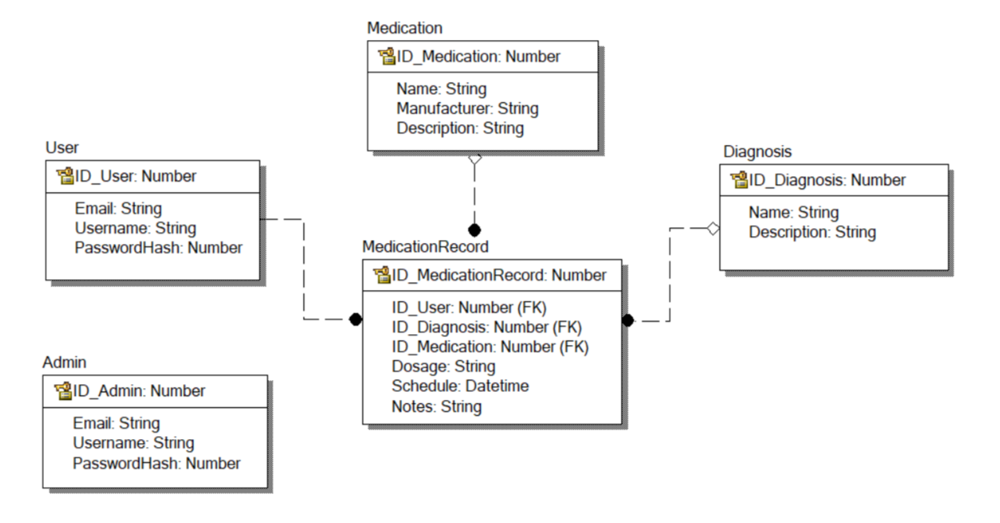

# Medication_plan
## План Приема Лекарств
## Требования
1.  _Регистрация пользователя_
   - Пользователь должен иметь возможность зарегистрироваться, указав свой email, имя пользователя и пароль.
   - После внесения данных требуется подтвердить email, указав код, который пришел на почту.

2. _Логин и логаут пользователя_
   - Зарегистрированный пользователь должен иметь возможность войти в систему, указав свой email и пароль.
   - После входа пользователь должен иметь доступ ко всем возможностям приложения.
   - Пользователь должен иметь возможность выйти из своего аккаунта.
   - Присутствует возможность войти в систему под специальным типом пользователя&nbsp;– администратором, которому доступны
     все возможности обычного пользователя, а также добавление/удаление в базу/из базы данных информации о пользователях, болезнях, лекарствах.

3. _Просмотр списка записей_ 
   - Список записей должен быть отображен на главной странице приложения.
   - Записи должны быть по умолчанию отсортированы по дате создания.
   - Должны быть реализованы другие способы сортировки записей (по всем возможным параметрам).

4. _Создание записи_ 
   - Пользователь должен иметь возможность создать новую запись, выбрав название болезни и лекарства и указав дозировку&nbsp;и время приема.
   - После создания записи, она должна быть сохранена в базе данных и отображена в списке записей.

5. _Просмотр деталей записи_
   - Пользователь должен иметь возможность просмотреть детали записи по нажатию на неё.

6. _Редактирование записи_ 
   - Пользователь должен иметь возможность отредактировать запись, то есть изменить параметры (например, дозировку).
   - После редактирования запись должна быть сохранена в базе данных.

7. _Удаление записи_
   - Пользователи могут удалять записи о приеме лекарств.
   - Удаленная запись должна быть удалена из базы данных.

